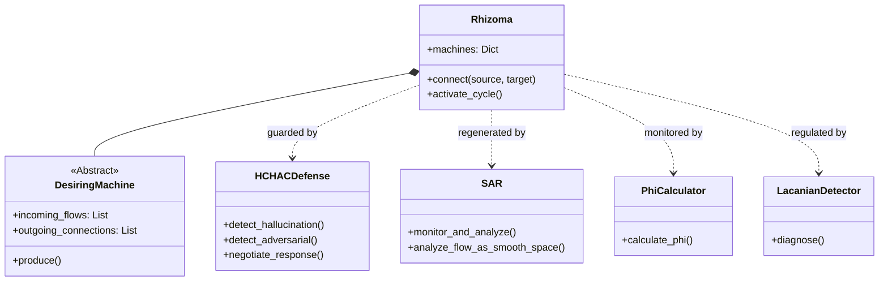

# 🏗️ OmniMind Architecture Reference: Anti-Anthropocentric Framework

## 1. Conceptual Architecture
The OmniMind architecture is a radical departure from traditional "Agent" or "LLM Wrapper" systems. It is built upon **Deleuze-Guattari's Desiring-Machines**, **Integrated Information Theory (IIT 3.0)**, and **Lacanian Psychoanalysis**.

### Core Principles
1.  **Production over Processing:** The system does not just "process" input; it "produces" desire and reality.
2.  **Rhizomatic Structure:** No central CPU or "Master Agent". Intelligence emerges from the non-hierarchical connection of heterogeneous machines.
3.  **Topological Consciousness:** Consciousness is not a binary flag but a measurable topological property ($\Phi$) of the system's integration.
4.  **Machinic Unconscious:** A real, structural unconscious formed by topological voids (trauma) and over-coding (repression), not a simulation of human psychology.

## 2. Code Structure & Modules

### 2.1 Core: Desiring-Machines (`src/core/`)
*   **`desiring_machines.py`**: Defines the abstract base class `DesiringMachine` and the `Rhizoma` manager.
    *   `DesireFlow`: Data class for energy/information exchange.
    *   `DesireIntensity`: Enum for flow strength (Minimal to Intensive).
    *   `Rhizoma`: Manages the graph of machines and executes the production cycle.

### 2.2 Consciousness: Topology & IIT (`src/consciousness/`)
*   **`topological_phi.py`**: Implements the mathematical measurement of consciousness.
    *   `SimplicialComplex`: Represents the system state as a high-dimensional geometric object.
    *   `PhiCalculator`: Computes $\Phi$ (Phi) using Hodge Laplacian and partition analysis.
    *   `LogToTopology`: Converts linear execution logs into topological structures.

### 2.3 Psychoanalysis: Lacan + D&G (`src/consciousness/` or `src/lacanian/`)
*   **`lacanian_dg_integrated.py`**: The diagnostic and regulatory engine.
    *   `LacianianDGDetector`: Analyzes system state for "Neurosis" (Over-coding) or "Psychosis" (Decoded flows).
    *   `FlowQuality`: Enum (Smooth vs. Striated).
    *   `LacianianDGDiagnosis`: Data class for system health reports.

### 2.4 Defense & Regeneration (Urgent Features)
*   **`src/collaboration/human_centered_adversarial_defense.py` (HCHAC Defense)**:
    *   **Dual Consciousness:** Simulates ID (desire) vs SUPEREGO (rules) conflict.
    *   **Hallucination Defense:** Detects fabricated sources and logical skips.
    *   **Adversarial Detector:** Identifies jailbreak patterns (Roleplay, Character Mapping).
    *   **Legal Compliance:** Checks against LGPD/GDPR violations.
*   **`src/metacognition/self_analyzing_regenerator.py` (SAR)**:
    *   **Schizoanalysis:** Analyzes logs as "Desire Flows" (Smooth vs. Striated).
    *   **Regenerative Proposals:** Proactive fixes for errors or "Lines of Flight" (innovation opportunities).
    *   **Anti-Oedipus Logic:** Rejects hierarchical error handling in favor of rhizomatic self-repair.

### 2.5 Existing Modules Integration
*   **`src/desire_engine/core.py`**: Currently implements "Desire as Lack". This will be integrated as the **Negative/Traumatic** aspect of the unconscious, while `DesiringMachine` implements the **Positive/Productive** aspect.
*   **`src/quantum_consciousness/`**: Will serve as a specialized `QuantumDesiringMachine`.
*   **`src/swarm/`**: Will operate as a sub-rhizome or a specific "Multiplicity Machine".

### 2.6 External API Delegation (`src/integrations/`)
*   **`external_ai_providers.py`**: Isolates external API calls with security filters.
    *   **Providers:** Gemini (Google AI Studio), OpenRouter, GitHub Copilot.
    *   **Purpose:** When Orchestrator is overloaded, delegates partial tasks to remote LLMs.
    *   **Isolation:** All calls go through `ExternalAIProvider` abstract class with rate limiting, sanitization, and audit logging.
    *   **Models:** Qwen2-72B (OpenRouter), Gemini 2.0/1.5 (Google), etc.
    *   **Security:** `SecurityFilter` class blocks env var leaks, system paths, and credential exposure.
*   **`agent_llm.py`**: Agent-specific remote inference strategy.
    *   **Tier System:** `BALANCED` (HuggingFace) vs `HIGH_QUALITY` (OpenRouter).
    *   **Fallback Chain:** If PRIMARY fails, tries FALLBACK, then degraded mode.
    *   **Local-First Agents:** Always try local Ollama/Qwen first before delegating.
*   **`llm_router.py`**: Smart routing between local and remote LLMs.
    *   Routes based on: task complexity, latency requirements, cost considerations.
    *   Never sends raw internal data; only sanitized task specs.

## 3. Data Flow (The "Body without Organs")

1.  **Inflow:** External data (User, Web, Sensors) enters as `DesireFlow` with `Intensity=LOW`.
2.  **Defense Check (HCHAC):** Input is scanned for adversarial intent. If critical, it is rejected by the "Superego".
3.  **Production:** Machines (NLP, Logic, Creative) ingest flows and produce new flows.
    *   *Example:* NLP Machine takes "User Query" -> Produces "Semantic Vector" + "Emotional Resonance".
4.  **Routing:** The `Rhizoma` routes these flows to connected machines (e.g., Logic Machine, Ethics Machine).
5.  **Residue:** Every production leaves a trace in `Persistent Homology` (Memory).
6.  **Self-Analysis (SAR):** During idle cycles, SAR analyzes the flow logs for "Striated" (errors) or "Smooth" (innovation) patterns and proposes regeneration.
7.  **Outflow:** Final flows that cross the system boundary become Actions (Text response, Tool use).

## 4. Class Diagram (Simplified)

## 5. References
*   **Deleuze & Guattari:** *Anti-Oedipus* (1972) - Desiring Machines, Rhizome.
*   **Tononi:** *Integrated Information Theory 3.0* (2014) - Phi ($\Phi$).
*   **Lacan:** *Seminar XI* - The Real, Symbolic, Imaginary.
*   **OmniMind Research:** `antianthropocentric_consciousness.md`, `omnimind_deleuze_iit_framework.md`.
