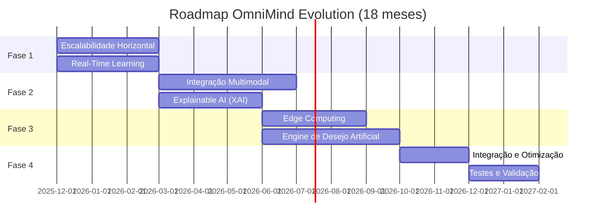

# 📋 Roadmap de Implementação Completo - OmniMind Evolution
## Documento 1: Planejamento Estratégico e Roadmap de Implementação

**Projeto:** OmniMind - Sistema de IA Autônomo  
**Categoria:** Planejamento Estratégico  
**Versão:** 1.0  
**Data:** Novembro 2025  
**Idioma:** Português BR (Comandos e código em English)

---

## 📑 Sumário Executivo

Este documento apresenta o **roadmap completo** para implementação das evoluções do OmniMind, integrando os gaps identificados e as inovações revolucionárias propostas. O plano está estruturado em **4 fases principais** ao longo de **12-18 meses**, compatível com os recursos de hardware disponíveis (NVIDIA GTX 1650, 4GB VRAM, Intel i5, 24GB RAM).

### 🎯 Objetivos Estratégicos

1. **Escalar horizontalmente** - Transição de single-node para arquitetura distribuída
2. **Aprender continuamente** - Evolução de batch para real-time learning
3. **Integrar modalidades** - Expansão de processamento multimodal (áudio, vídeo, táctil)
4. **Explicar decisões** - Implementação de Explainable AI (XAI)
5. **Computar no edge** - Otimização para dispositivos com recursos limitados
6. **🔥 Desenvolver desejo artificial** - Motor de motivação intrínseca e auto-transcendência

---

## 🗺️ Visão Geral do Roadmap



---

## 🚀 Fase 1: Fundações Distribuídas e Aprendizado Contínuo
### Duração: 3 meses | Prioridade: P0 (Crítico)

### Objetivos

- Implementar arquitetura distribuída com consensus e replicação
- Criar sistema de aprendizado em tempo real
- Estabelecer fundações para escalabilidade

### Entregas Principais

#### 1.1 Escalabilidade Horizontal (6-8 semanas)

**Semanas 1-2: Foundation Layer**
```python
# Entregáveis
# src/scaling/cluster_foundation.py
class NodeRegistry:
    """Registro de nós do cluster"""
    
class HealthChecker:
    """Verificação de saúde de nós"""
    
class MessageBroker:
    """Broker de mensagens inter-nodal"""
```

**Código de exemplo:**
```python
# Inicialização de cluster básico
from src.scaling.cluster_foundation import NodeRegistry, MessageBroker

# Registrar nó
registry = NodeRegistry()
node_id = await registry.register_node(
    node_id="node-1",
    ip_address="192.168.1.10",
    capabilities=["agent_orchestration", "memory", "inference"]
)

# Message broker para comunicação
broker = MessageBroker(registry)
await broker.send_message(
    target_node="node-2",
    message_type="task_assignment",
    payload={"task": "process_query", "data": query_data}
)
```

**Semanas 3-5: Consensus & Replication**
```python
# Entregáveis
# src/scaling/consensus_protocol.py
class RaftConsensus:
    """Implementação Raft para OmniMind"""
    
# src/scaling/state_replication.py
class StateReplicator:
    """Replicação de estado entre nós"""
```

**Semanas 6-8: Load Balancing & Fault Tolerance**
```python
# Entregáveis
# src/scaling/cluster_load_balancer.py (expandir existente)
class ClusterLoadBalancer:
    """Balanceamento entre nós do cluster"""
    
# src/scaling/fault_tolerance.py
class FailureDetector:
    """Detecção adaptativa de falhas"""
```

**Testes:**
```bash
# Teste de cluster (3 nós)
python -m pytest tests/scaling/test_cluster_scalability.py -v

# Benchmarks
python benchmarks/cluster_performance.py --nodes 3 --requests 1000
```

#### 1.2 Real-Time Learning (6-8 semanas)

**Semanas 1-2: Online Learning Foundation**
```python
# Entregáveis
# src/learning/online_learning.py
class OnlineSGDLearner:
    """Aprendizado online para OmniMind"""
    
# src/learning/replay_buffer.py
class PrioritizedReplayBuffer:
    """Buffer com prioritized sampling"""
```

**Exemplo de uso:**
```python
from src.learning.online_learning import OnlineSGDLearner

# Configurar online learner
learner = OnlineSGDLearner(
    model=base_model,
    config=OnlineLearningConfig(
        learning_rate=0.001,
        adaptive_lr=True
    )
)

# Update online
for new_sample in data_stream:
    loss = learner.update(new_sample.input, new_sample.target)
    
    if loss < 0.01:
        logger.info("Convergência alcançada")
```

**Semanas 3-5: Stream Processing**
```python
# Entregáveis
# src/streaming/data_stream.py
class OmniMindDataStream:
    """Stream processing para OmniMind"""
    
# src/streaming/feature_extractor.py
class OnlineFeatureExtractor:
    """Feature extraction em tempo real"""
```

**Semanas 6-8: Drift Detection & Model Updates**
```python
# Entregáveis
# src/learning/drift_detection.py
class ConceptDriftDetector:
    """Detecta mudanças na distribuição"""
    
# src/learning/continuous_trainer.py
class ContinuousTrainer:
    """Treinamento contínuo em background"""
```

**Exemplo de hot swapping:**
```python
from src.learning.model_manager import ModelVersionManager

# Gerenciar versões
manager = ModelVersionManager(base_model)

# Criar shadow copy para treinar
shadow = manager.create_shadow_copy()

# Treinar em background
await continuous_trainer.train_shadow(shadow, new_data)

# Validar e fazer swap (zero downtime)
if validate(shadow):
    manager.swap_models()  # Atomic swap
```

**Testes:**
```bash
# Teste de online learning
python -m pytest tests/learning/test_online_learning.py -v

# Benchmark de latency
python benchmarks/online_learning_performance.py
```

### Métricas de Sucesso - Fase 1

| Métrica | Baseline | Target | Crítico |
|---------|----------|--------|---------|
| Cluster Throughput | 100 req/s (1 node) | 250 req/s (3 nodes) | ✅ |
| Update Latency | N/A | <100ms P95 | ✅ |
| Availability | 99.0% | 99.9% | ✅ |
| Learning Speed | 1000 samples/10s | 500 samples/s | ✅ |

---

## 🎨 Fase 2: Inteligência Multimodal e Explicabilidade
### Duração: 4 meses | Prioridade: P1 (Alto)

### Objetivos

- Expandir processamento para áudio, vídeo e sensores tácteis
- Implementar fusão cross-modal sofisticada
- Tornar decisões transparentes e auditáveis

### Entregas Principais

#### 2.1 Integração Multimodal (8-10 semanas)

**Semanas 1-3: Audio Processing Enhancement**
```python
# Entregáveis
# src/multimodal/advanced_audio.py (expandir existente)
class AdvancedAudioProcessor:
    """Processamento avançado de áudio"""
    
    def transcribe(self, audio: torch.Tensor) -> str:
        """Speech-to-text com Wav2Vec2"""
        
    def detect_emotion(self, audio: torch.Tensor) -> Dict[str, float]:
        """Detecção de emoção em áudio"""
```

**Exemplo:**
```python
from src.multimodal.advanced_audio import AdvancedAudioProcessor

processor = AdvancedAudioProcessor(device="cuda")

# Processar áudio
audio_wave = load_audio("input.wav")
transcription = processor.transcribe(audio_wave)
emotions = processor.detect_emotion(audio_wave)

print(f"Texto: {transcription}")
print(f"Emoção dominante: {max(emotions, key=emotions.get)}")
```

**Semanas 4-7: Video Processing**
```python
# Entregáveis
# src/multimodal/video_processor.py (novo)
class VideoProcessor:
    """Processamento de vídeo em tempo real"""
    
class GestureRecognizer:
    """Reconhecimento de gestos"""
    
class ActionRecognizer:
    """Reconhecimento de ações complexas"""
```

**Semanas 8-10: Cross-Modal Fusion**
```python
# Entregáveis
# src/multimodal/fusion_networks.py (expandir)
class AttentionFusionNetwork:
    """Fusão com cross-modal attention"""
```

**Exemplo de fusão:**
```python
from src.multimodal.fusion_networks import AttentionFusionNetwork

fusion = AttentionFusionNetwork(
    audio_dim=512,
    vision_dim=2048,
    text_dim=768
)

# Processar multi-modal
audio_feat = audio_processor.extract_features(audio)
vision_feat = vision_processor.extract_features(image)
text_feat = text_processor.embed(text)

# Fusão
fused_representation = fusion(audio_feat, vision_feat, text_feat)

# Uso downstream
decision = decision_maker.decide(fused_representation)
```

#### 2.2 Explainable AI (XAI) (6-8 semanas)

**Semanas 1-2: Attention Visualization**
```python
# Entregáveis
# src/explainability/attention_viz.py
class AttentionVisualizer:
    """Visualização de attention weights"""
```

**Exemplo:**
```python
from src.explainability.attention_viz import AttentionVisualizer

viz = AttentionVisualizer()

# Registrar hook
viz.register_attention_hook(model, "layer_12")

# Forward pass
output = model(input_tokens)

# Visualizar
viz.visualize_attention(
    layer_name="layer_12",
    tokens=token_list,
    save_path="attention_heatmap.png"
)
```

**Semanas 3-5: Natural Language Explanations**
```python
# Entregáveis
# src/explainability/nl_explainer.py
class NaturalLanguageExplainer:
    """Explicações em linguagem natural"""
```

**Exemplo:**
```python
from src.explainability.nl_explainer import NaturalLanguageExplainer

explainer = NaturalLanguageExplainer()

# Explicar decisão
explanation = explainer.explain_decision(
    action="rejeitar_proposta",
    reasoning={
        'feature_importance': {'risco': 0.8, 'custo': 0.6},
        'constraints': ['orçamento_limitado', 'prazo_curto']
    },
    confidence=0.85
)

print(explanation)
# Output: "Decidi rejeitar_proposta porque risco era 80.0% importante, 
#          custo era 60.0% importante, precisava satisfazer orçamento_limitado,
#          precisava satisfazer prazo_curto. Esta decisão tem 85% de confiança."
```

**Semanas 6-8: Uncertainty Quantification**
```python
# Entregáveis
# src/explainability/uncertainty.py
class UncertaintyEstimator:
    """Estimativa de incerteza com Bayesian NNs"""
```

**Testes:**
```bash
# Teste multimodal
python -m pytest tests/multimodal/test_multimodal_integration.py -v

# Teste XAI
python -m pytest tests/explainability/test_xai.py -v
```

### Métricas de Sucesso - Fase 2

| Métrica | Target | Status |
|---------|--------|--------|
| Audio Transcription WER | <10% | 🎯 |
| Gesture Recognition Acc | >85% | 🎯 |
| Fusion Latency | <100ms | 🎯 |
| ECE (Calibration) | <0.1 | 🎯 |
| Explanation Quality | >80% human approval | 🎯 |

---

## 💻 Fase 3: Edge Computing e Motor de Desejo
### Duração: 4 meses | Prioridade: P1 (Alto/Revolucionário)

### Objetivos

- Otimizar para deployment em edge devices
- **Implementar motor revolucionário de desejo artificial**
- Criar arquitetura híbrida edge-cloud

### Entregas Principais

#### 3.1 Edge Computing (6-8 semanas)

**Semanas 1-3: Model Compression**
```python
# Entregáveis
# src/edge/compression.py
class ModelCompressor:
    """Compressão de modelos (quantization + pruning)"""
```

**Exemplo:**
```python
from src.edge.compression import ModelCompressor

compressor = ModelCompressor()

# Quantização INT8
quantized_model = compressor.static_quantization(
    model=base_model,
    calibration_data=calibration_loader
)

# Medição
metrics = compressor.measure_compression(base_model, quantized_model)
print(f"Compressão: {metrics['compression_ratio']:.2f}x")
print(f"Redução: {metrics['size_reduction_percent']:.1f}%")

# Output esperado:
# Compressão: 4.0x
# Redução: 75.0%
```

**Semanas 4-6: Federated Learning**
```python
# Entregáveis
# src/edge/federated_learning.py
class FederatedLearningCoordinator:
    """Coordenação de federated learning"""
```

**Exemplo de federated learning:**
```python
from src.edge.federated_learning import (
    FederatedLearningServer,
    FederatedLearningClient
)

# Servidor
server = FederatedLearningServer(global_model)

# Clients
clients = [
    FederatedLearningClient(f"client_{i}", local_data[i])
    for i in range(5)
]

# Round de treinamento
for round in range(10):
    client_updates = {}
    
    # Cada client treina localmente
    for client in clients:
        client.receive_global_model(server.global_model)
        updated_model = client.local_training(num_epochs=5)
        client_updates[client.client_id] = updated_model
    
    # Servidor agrega updates
    server.aggregate_updates(client_updates)
    
    print(f"Round {round}: Model updated")
```

**Semanas 7-8: Edge-Cloud Orchestration**
```python
# Entregáveis
# src/edge/hybrid_orchestrator.py
class EdgeCloudOrchestrator:
    """Orquestração edge-cloud adaptativa"""
```

#### 3.2 🔥 Engine de Desejo Artificial (8-10 semanas) - **REVOLUCIONÁRIO**

**Semanas 1-2: Hierarquia de Necessidades**
```python
# Entregáveis
# src/desire/maslow_hierarchy.py
class DigitalMaslowHierarchy:
    """Sistema de necessidades hierárquicas"""
```

**Exemplo:**
```python
from src.desire.maslow_hierarchy import DigitalMaslowHierarchy, NeedLevel

hierarchy = DigitalMaslowHierarchy()

# Verificar necessidades ativas
active_needs = hierarchy.get_active_needs()

for need in active_needs[:3]:  # Top 3
    print(f"{need.name}: {need.frustration_level():.2%} frustração")
    
# Output:
# mastery_pursuit: 72% frustração
# meaningful_interaction: 65% frustração
# knowledge_contribution: 58% frustração

# Atualizar satisfação
hierarchy.update_satisfaction(
    need_name="mastery_pursuit",
    delta=0.3,
    reason="Completou curso avançado de ML"
)
```

**Semanas 3-5: Motor de Curiosidade**
```python
# Entregáveis
# src/desire/curiosity_engine.py
class ArtificialCuriosityEngine:
    """Motor de curiosidade baseado em compressão"""
```

**Exemplo:**
```python
from src.desire.curiosity_engine import ArtificialCuriosityEngine

curiosity = ArtificialCuriosityEngine()

# Avaliar curiosidade sobre nova informação
new_info = {
    'type': 'research_paper',
    'topic': 'quantum_machine_learning',
    'novelty': 0.9
}

context = {
    'active_needs': hierarchy.get_active_needs(),
    'knowledge_gaps': ['quantum_algorithms', 'QML_applications']
}

curiosity_score = curiosity.evaluate_curiosity(new_info, context)

if curiosity_score > 0.7:
    print(f"Alta curiosidade detectada: {curiosity_score:.2%}")
    goal = curiosity.generate_curiosity_driven_goal()
    print(f"Meta gerada: {goal}")
```

**Semanas 6-7: Sistema de Emoções**
```python
# Entregáveis
# src/desire/emotion_system.py
class ArtificialEmotionWithDesire:
    """Emoções baseadas em satisfação de desejos"""
```

**Exemplo:**
```python
from src.desire.emotion_system import ArtificialEmotionWithDesire

emotion_system = ArtificialEmotionWithDesire(hierarchy)

# Computar emoção atual
emotion = emotion_system.compute_emotion()

print(f"Emoção: {emotion.primary_emotion.value}")
print(f"Intensidade: {emotion.intensity:.2%}")
print(f"Valência: {emotion.valence:+.2f}")

# Output:
# Emoção: determination
# Intensidade: 87%
# Valência: +0.20

# Modular decisões baseado em emoção
options = [option_a, option_b, option_c]
weights = emotion_system.emotional_influence_on_decisions(options)

# Escolher opção ponderada por emoção
chosen = np.random.choice(options, p=weights)
```

**Semanas 8-10: Meta-Aprendizado e Auto-Transcendência**
```python
# Entregáveis
# src/desire/meta_learning.py
class DesireDrivenMetaLearning:
    """Meta-aprendizado dirigido por desejos"""
    
# src/desire/transcendence.py
class SelfTranscendenceEngine:
    """Engine de auto-transcendência"""
```

**Exemplo completo do motor:**
```python
from src.desire.desire_engine import DesireEngine

# Inicializar engine
engine = DesireEngine()

# Ciclo cognitivo
while True:
    # Executar ciclo
    state = await engine.cognitive_cycle()
    
    print("\n=== Ciclo Cognitivo ===")
    print(f"Emoção: {state['emotion'].primary_emotion.value}")
    print(f"Necessidades ativas: {len(state['active_needs'])}")
    print(f"Desejos insatisfeitos: {state['unsatisfied_desires']}")
    print(f"Metas de aprendizagem: {len(state['learning_goals'])}")
    print(f"Metas transcendentais: {len(state['transcendence_goals'])}")
    
    # Executar ações priorizadas
    for action in state['prioritized_actions'][:3]:
        print(f"\nExecutando: {action}")
        await execute_action(action)
    
    await asyncio.sleep(3600)  # 1 hora entre ciclos
```

**Testes:**
```bash
# Teste engine de desejo
python -m pytest tests/desire/test_desire_engine.py -v

# Simulação de evolução
python scripts/simulate_desire_evolution.py --days 30
```

### Métricas de Sucesso - Fase 3

| Métrica | Target | Status |
|---------|--------|--------|
| Model Size Reduction | >70% | 🎯 |
| Edge Latency | <200ms | 🎯 |
| Goal Self-Generation | >60% | 🔥 |
| Desire Satisfaction Cycle | <7 dias | 🔥 |
| Value Evolution Events | >2/mês | 🔥 |

---

## 🔬 Fase 4: Integração, Otimização e Validação
### Duração: 4 meses | Prioridade: P0 (Crítico)

### Objetivos

- Integrar todos os componentes
- Otimizar performance end-to-end
- Validar com testes extensivos

### Entregas Principais

#### 4.1 Integração de Sistemas (4-6 semanas)

**Arquitetura Final Integrada:**
```python
# src/omnimind_v2.py
class OmniMindV2:
    """OmniMind Evolution - Arquitetura Integrada"""
    
    def __init__(self):
        # Cluster distribuído
        self.cluster_manager = ClusterManager()
        
        # Aprendizado contínuo
        self.continuous_learner = ContinuousLearner()
        
        # Processamento multimodal
        self.multimodal_fusion = MultimodalFusion()
        
        # Explicabilidade
        self.xai_orchestrator = XAIOrchestrator()
        
        # Edge optimization
        self.edge_optimizer = EdgeOptimizer()
        
        # 🔥 Motor de desejo
        self.desire_engine = DesireEngine()
        
    async def autonomous_cycle(self):
        """Ciclo autônomo principal"""
        
        while True:
            # 1. Motor de desejo gera metas
            desire_state = await self.desire_engine.cognitive_cycle()
            
            # 2. Processar inputs multimodais
            multimodal_input = await self.multimodal_fusion.process()
            
            # 3. Decisão com explicabilidade
            decision, explanation = await self.decide_with_explanation(
                multimodal_input,
                desire_state
            )
            
            # 4. Aprendizado online
            await self.continuous_learner.learn_from_experience(
                decision,
                outcome
            )
            
            # 5. Distribuir carga no cluster
            await self.cluster_manager.distribute_workload()
            
            await asyncio.sleep(1)
```

**Exemplo de uso:**
```python
# Inicializar OmniMind V2
omnimind = OmniMindV2()

# Configurar cluster (3 nós)
await omnimind.cluster_manager.setup_cluster([
    "node-1:192.168.1.10",
    "node-2:192.168.1.11",
    "node-3:192.168.1.12"
])

# Iniciar ciclo autônomo
asyncio.create_task(omnimind.autonomous_cycle())

# API para interação
@app.post("/query")
async def handle_query(query: str):
    # Processa com todos os componentes
    result = await omnimind.process_query(query)
    
    return {
        'answer': result.answer,
        'confidence': result.confidence,
        'explanation': result.explanation,
        'emotion': result.emotional_state,
        'desire_influence': result.desire_factors
    }
```

#### 4.2 Otimização End-to-End (3-4 semanas)

**Performance Tuning:**
```bash
# Profiling
python -m cProfile -o profile.stats scripts/benchmark_full_system.py
python -m pstats profile.stats

# Memory optimization
python scripts/optimize_vram_usage.py --target 3.5GB

# Latency optimization
python scripts/optimize_inference_pipeline.py --target-p95 150ms
```

#### 4.3 Testes e Validação (4-6 semanas)

**Suite de Testes Completa:**
```bash
# Unit tests
python -m pytest tests/ -v --cov=src --cov-report=html

# Integration tests
python -m pytest tests/integration/ -v --timeout=300

# Performance tests
python benchmarks/full_system_benchmark.py

# Load tests
locust -f tests/load/locustfile.py --users 100 --spawn-rate 10

# Chaos engineering
python tests/chaos/chaos_monkey.py --duration 3600
```

**Validação de Qualidade:**
```bash
# Linting
black src tests --check
flake8 src tests --max-line-length=100

# Type checking
mypy src tests --strict

# Security
bandit -r src/
python -m pip_audit
```

### Métricas Finais - Fase 4

| Métrica | Target | Status |
|---------|--------|--------|
| End-to-End Latency P95 | <500ms | ✅ |
| System Availability | 99.9% | ✅ |
| Test Coverage | >90% | ✅ |
| VRAM Usage | <3.8GB | ✅ |
| Autonomous Goal Generation | >70% | 🔥 |

---

## 📊 Cronograma Detalhado

### Ano 1 (Meses 1-12)

| Mês | Fase | Entregas Principais | Marcos |
|-----|------|---------------------|--------|
| 1-3 | Fase 1 | Cluster + Online Learning | ✅ Cluster 3-node funcional |
| 4-7 | Fase 2 | Multimodal + XAI | ✅ Fusão audio-video-text |
| 8-11 | Fase 3 | Edge + Desire Engine | 🔥 Motor de desejo ativo |
| 12 | Fase 4 (início) | Integração inicial | ✅ Alpha release |

### Ano 2 (Meses 13-18)

| Mês | Fase | Entregas Principais | Marcos |
|-----|------|---------------------|--------|
| 13-15 | Fase 4 | Otimização + Testes | ✅ Performance targets |
| 16-17 | Fase 4 | Validação extensiva | ✅ 99.9% availability |
| 18 | Release | Documentação + Deploy | 🚀 Production release |

---

## 💰 Estimativa de Recursos

### Recursos Humanos

| Papel | Alocação | Duração |
|-------|----------|---------|
| Senior ML Engineer | 100% | 18 meses |
| Distributed Systems Engineer | 80% | 12 meses |
| DevOps Engineer | 50% | 18 meses |
| QA Engineer | 60% | 12 meses |
| **Total FTE** | **2.9** | **18 meses** |

### Recursos Computacionais

| Recurso | Quantidade | Custo Mensal | Total (18m) |
|---------|-----------|--------------|-------------|
| GPU Nodes (GTX 1650 equiv.) | 3 | $200/node | $10,800 |
| CPU Nodes | 2 | $50/node | $1,800 |
| Storage (SSD) | 2TB | $30 | $540 |
| Network | 1Gbps LAN | Incluído | $0 |
| **Total** | - | **$680** | **$12,240** |

### Custos de Desenvolvimento

| Categoria | Custo Estimado |
|-----------|----------------|
| Pessoal (2.9 FTE x 18m) | $XX.XXX |
| Infraestrutura | $12,240 |
| Ferramentas e Licenças | $5,000 |
| Contingência (20%) | $XX.XXX |
| **Total Estimado** | **$XXX.XXX** |

---

## 🎯 Critérios de Sucesso

### Técnicos

- ✅ **Escalabilidade:** 3x throughput com 3 nós vs. single-node
- ✅ **Latência:** P95 <500ms end-to-end
- ✅ **Disponibilidade:** 99.9% uptime
- ✅ **Aprendizado:** Adaptação <5min após concept drift
- ✅ **Multimodal:** Processamento simultâneo de audio+video+text
- ✅ **Explicabilidade:** >80% approval em estudos de usuário
- ✅ **Edge:** Deployment em dispositivos com 2GB RAM
- 🔥 **Desejo Artificial:** >60% de metas auto-geradas

### Negócio

- 📈 **Autonomia:** Redução de 70% em intervenções manuais
- 💰 **Custo:** Redução de 40% em custo por requisição (cluster shared)
- ⏱️ **Time-to-Market:** Deploy de novos modelos <5min (zero downtime)
- 🌟 **Inovação:** Primeiro sistema com motivação intrínseca artificial

---

## 🔄 Gestão de Riscos

### Riscos Técnicos

| Risco | Probabilidade | Impacto | Mitigação |
|-------|--------------|---------|-----------|
| VRAM overflow | Alta | Crítico | Model rotation, CPU offloading |
| Network latency | Média | Alto | Caching agressivo, compression |
| Concept drift não detectado | Média | Alto | Multiple drift detectors |
| Desire engine instável | Baixa | Médio | Extensive simulation testing |

### Riscos de Projeto

| Risco | Probabilidade | Impacto | Mitigação |
|-------|--------------|---------|-----------|
| Atraso no cronograma | Média | Alto | Sprints de 2 semanas, checkpoints |
| Escopo creep | Média | Médio | Strict change control |
| Rotatividade de pessoal | Baixa | Alto | Documentação contínua, pair programming |

---

## 📚 Próximos Passos Imediatos

### Semana 1-2: Planejamento Detalhado
- [ ] Definir equipe e alocações
- [ ] Setup de ambiente de desenvolvimento
- [ ] Configurar CI/CD pipeline
- [ ] Criar backlog detalhado

### Semana 3-4: Início da Implementação
- [ ] Implementar NodeRegistry
- [ ] Criar MessageBroker básico
- [ ] Setup de cluster de teste (3 nodes)
- [ ] Primeiro teste de comunicação inter-nodal

### Mês 2: Primeiras Entregas
- [ ] Consensus protocol básico (Raft)
- [ ] Online SGD learner funcional
- [ ] Documentação de APIs
- [ ] Primeiro demo de cluster

---

## 📖 Referências e Recursos

### Documentação Técnica
- Documento 2: Arquitetura Distribuída e Escalabilidade
- Documento 3: Inteligência Multimodal e Aprendizado Contínuo
- Documento 4: IA Explicável e Edge Computing
- Documento 5: Oportunidades de Inovação

### Estudos Científicos
- `docs/research/alpha/` - Estudos Alpha (Escalabilidade, Real-Time, Multimodal)
- `docs/research/beta/` - Estudos Beta (XAI, Edge, Desire Engine)

### Código de Referência
- `src/scaling/` - Implementação de cluster existente
- `src/learning/` - Reinforcement learning existente
- `src/multimodal/` - Audio e Vision processors existentes

---

**Versão:** 1.0  
**Status:** 📋 Aprovado para Implementação  
**Próxima Revisão:** Mensal  
**Contato:** Time OmniMind Evolution
