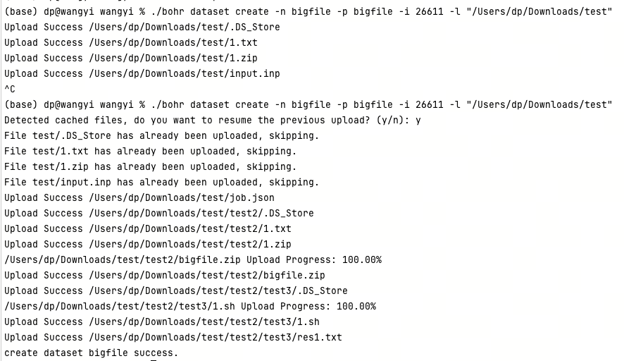

Job Management Commands：job
Query：list
Command Entry: bohr job list

Summary:

Usage:
  bohr job list [flags]

Aliases:
  list, -ls

Flags:
      --csv                output with CSV format
  -f, --fail               only show failed job
  -i, --finish             only show finished job
  -h, --help               help for list
  -j, --job_group_id int   job group id
      --json               output with JSON format
      --noheader           does not print header information
  -n, --number int         number of results to be displayed(default 10)
  -p, --pending            only show pending job
  -q, --quiet              only show job id
  -r, --running            only show running job
  -s, --scheduling         only show scheduling job
  -d, --stopped            only show stopped job
  -t, --stopping           only show stopping job
      --yaml               output in YAML format

Parameter description:

Parameter	Abbreviation	Description	Required
--job_group_id	-j	Show tasks under job group id	N o
--fail	-f	Only show failed tasks	No
--pending	-p	Only show pending tasks	No
--running	-r	Only show running tasks	No
--finish	-i	Only show finished tasks	No
--scheduling	-s	Only show scheduling tasks	No
--stopping	-t	Only show stopping tasks	No
--stopped	-d	Only show stopped tasks	No
--quiet	-q	Only show Job ID	No
--number	-n	Number of jobs to display	No
Example：

bohr job list -n 20 --yaml
# Display the most recent 20 job details in YAML format
bohr job list -j 1022 -f
# View all failed jobs under Job Group ID 1022

bohr job list

Submit：submit
Command Entry: bohr job submit

Summary:

Usage:
  bohr job submit [flags]

Examples:
$ bohr job submit

Flags:
  -c, --command string             command
  -i, --config_file string         config file
  -h, --help                       help for submit
  -m, --image_address string       image name
  -p, --input_directory string     input directory path (default "./")
  -g, --job_group_id int           job group id
  -n, --job_name string            job name
  -l, --log_file string            log file
  -t, --machine_type string        machine type
      --max_reschedule_times int   max reschedule times
      --max_run_time int           max run time(measured in minutes)
      --nnode int                  nnode (default 1)
      --project_id int             project id
  -r, --result_path string         result path

Parameter description:

Parameter	Abbreviation	Required	Description
--command	-c	Yes	Task execution command
--config_file	-i	No	Predefined configuration file; fields declared in the command line will replace those in the file
--image_address	-m	Yes	Image address; select different image addresses based on task type
--input_directory	-p	No	Input files, e.g., -p ./ means current directory (default is ./)
--job_group_id	-g	No	Job group id (obtained from bohr job_group create)
--job_name	-n	No	Job name
--log_file	-l	No	Log file
--machine_type	-t	Yes	Machine configuration
--max_reschedule_times		No	Maximum reschedule times
--max_run_time		No	Maximum runtime (in minutes)）
--nnode		No	Number of compute nodes to run in parallel
--project_id		Yes	Project ID, which you can view in project management
--result_path	-r	No	Automatically download result files to specified directory; data can be downloaded to personal or share disk, with parameter -r followed by a path starting with /share or /personal
Attention
The job_group_id used here is different from the JobGroupId obtained after creating a task. The job_group_id needs to be created through bohr job_group create to meet the requirement of submitting multiple tasks into the same job group.

Example：

bohr job submit -i job.json -p ./input 
# Use the files in job.json and treat the files in the input directory as input.

--config_file -i JSON file example

{
    "job_name": "DeePMD-kit test",
    "command": "cd se_e2_a && dp train input.json > tmp_log 2>&1 && dp freeze -o graph.pb",
    "log_file": "se_e2_a/tmp_log",
    "backward_files": ["se_e2_a/lcurve.out","se_e2_a/graph.pb"],
    "project_id": 0000,
    "machine_type": "c32_m64_cpu",
    "image_address": "registry.dp.tech/dptech/lammps:29Sep2021",
    "input_directory": "./Bohrium_LAMMPS_example",
    "job_group_id": 0000,
    "result_path": "/personal", 
    "dataset_path": ["/bohr/test-rihu/v1"],
    "max_reschedule_times": 2,
    "max_run_time": 12,
    "nnode": 1
}

Delete：delete
Command Entry:

bohr job delete

Summary:

Usage:
  bohr job delete <job_id>... [flags]

Flags:
  -h, --help          help for delete
      --job_id ints   Job ID(s) (can be used multiple times)

Parameter description:

Parameter	Abbreviation	Description	Required
--job_id		Deleted job ID	Yes
Example：

bohr job delete  1234  2345 
# Delete the task with IDs 1234 and 2345

Terminate early：terminate
Command Entry:

bohr job terminate

Summary:

Usage:
  bohr job terminate <job_id>... [flags]

Flags:
  -h, --help          help for terminate
      --job_id ints   Job ID(s)  (can be used multiple times)

Parameter description:

Parameter	Abbreviation	Description	Required
--job_id	-	Job ID for early termination	Yes
Example：

bohr job terminate  1234 2345
# Terminate the task with IDs 1234 and 2345 early

Kill：kill
Command Entry:

bohr job kill

Summary:

Usage:
  bohr job kill <job_id>... [flags]

Flags:
  -h, --help          help for kill
      --job_id ints   Job ID(s) (can be used multiple times)

Parameter description:

Parameter	Abbreviation	Description	Required
--job_id		kill job ID	Yes
Example：

bohr job kill  1234 2345
# Kill the task with IDs 1234 and 2345

Download log：log
Command Entry:

bohr job log

Summary:

Usage:
  bohr job log [flags]

Flags:
  -h, --help              help for log
  -j, --job_id ints       Job ID(s) (can be used multiple times)
  -o, --out string   specify the directory to save downloaded files (default "./")

Parameter description:

Parameter	Abbreviation	Description	Required
--job_id	-j	jobs id	Yes
--out	-o	Save the logs to a local path for example: -o ./ indicates the current directory (default is ./)	No
案例：

bohr job log -j 1234 -j 2345 -o /opt
# Download the log files for Job IDs 1234 and 2345 and save them to the local /opt directory

Download：download
Command Entry:

bohr job download

Summary:

Usage:
  bohr job download [flags]

Aliases:
  download, -d

Flags:
  -h, --help              help for download
  -j, --job_id ints       Job ID(s) (can be used multiple times)
  -o, --out string   specify the directory to save downloaded files (default "./")

Parameter description:

Parameter	Abbreviation	Description	Required
--job_id	-j	Downloaded job ID	Yes
--out	-o	Save the outs to a local path for example: -o ./ indicates the current directory (default is ./)	No
Example：

bohr job download -j 1234 -j 2345 -o /opt
# Download the out files for Job IDs 1234 and 2345 and save them to the local /opt directory

Describe：describe
Command Entry:

bohr job describe

Summary:

Usage:
  bohr job describe [flags]

Flags:
      --csv           output with csv format
  -h, --help          help for describe
  -j, --job_id ints   Job ID(s) (can be used multiple times)
      --json          output with json format
  -l, --long          Long listing format
      --noheader      does not print header information
      --yaml          output with yaml format

Parameter description:

Parameter	Abbreviation	Description	Required
--job_id	-j	Jobs ID	Yes
--long	-l	Whether to display all the task information in detail	No
Example：

bohr job describe -j 1234 -j 2345 --json 
# Display the task details of Job IDs 1234 and 2345 in JSON format
bohr job describe -j 1234 -l 
# View the task with Job ID 1234 and display all its information in detail
Machine Configuration Command: machine
List All Machine Configurations: list
Command Entry:

bohr machine list

Summary:

Usage:
  bohr machine list [flags]

Aliases:
  list, -ls

Flags:
  -c, --chooseType string   cpu or gpu (default "cpu")
      --csv                 output with CSV format
  -h, --help                help for list
      --json                output with JSON format
      --noheader            does not print header information
  -s, --scene string        job or node or notebook (default "job")
      --yaml                output in YAML format

Parameter description:

Parameter	Abbreviation	Description	Required
--chooseType	-c	Specify machine type: cpu or gpu (default is cpu)	No
--scene	-s	Choose usage scenario: job, node, or notebook (default is job)	No
Example:

bohr machine list -c "gpu" --yaml 
# Display all GPU machine configurations and output in YAML format
bohr machine list -s "node"
# Display all machine types that support container node launching

bohr machine list

mage Management Command：image
List all images：list
Command Entry:

bohr image list

Summary:

Usage:
  bohr image list [flags]

Aliases:
  list, -ls

Flags:
      --csv           output with CSV format
  -h, --help          help for list
      --json          output with JSON format
      --noheader      does not print header information
  -t, --type string   type of the image.eg: bohr image list -t "DeePMD-kit" (default: custom image)
      --yaml          output in YAML format

Parameter description:

Parameter	Abbreviation	Description	Required
--type	-t	specify the image type (default: custom image)	否
--type -t Example of image types."

bohr image list -t "Basic Image"
bohr image list -t "DeePMD-kit"
bohr image list -t "DPGEN"
bohr image list -t "ABACUS"
bohr image list -t "CP2K"
bohr image list -t "LAMMPS"
bohr image list -t "GROMACS"
bohr image list -t "CALYPSO"
bohr image list -t "Quantum Espresso"
bohr image list -t "Uni-Mol"
bohr image list -t "TBPLaS"
bohr image list -t "DPEM"
bohr image list -t "FEALPy"
bohr image list -t "Amber"
bohr image list -t "Third-party software"

Example:

bohr image list --json 
# View all custom images in JSON format.
bohr image list -t "DeePMD-kit"
# Display all public images under DeePMD-kit (press Ctrl+C to exit).

image list

Pull the image to local.： pull
Only Bohrium’s public and your own custom images can be pulled (shared images from others are not supported).

Command Entry：

bohr image pull

Summary：

Usage:
  bohr image pull [flags]

Aliases:
  pull, -pull

Flags:
  -h, --help                   help for pull
  -i, --image_address string   image_address of Bohrium

Parameter description：

Parameter	Abbreviation	Description	Required
--image_address	-i	image_address of Bohrium	yes
案例：

bohr image pull  registry.dp.tech/dptech/deepmd-kit:3.0.0b3-cuda12.1
# Pull the public image deepmd-kit:3.0.0b3-cuda12.1 to the local Docker

Attention
Before running the bohr image pull command, you need to start the Docker daemon. The simplest way is to open the Docker client (such as Docker Desktop).

image pull

Delete the private image.：delete
Command Entry:

bohr image delete

Summary:

Usage:
  bohr image delete <imageId>... [flags]

Flags:
  -h, --help           help for delete
      --imageId ints   imageId(s) (can be used multiple times)

Parameter description：

Parameter	Abbreviation	Description	Required
--imageId	-	imageId	yes
Example:

bohr image delete 123 234
# Delete the private images with IDs 123 and 234.

Project Management Command：project
List all projects：list
Command Entry:

bohr project list

Summary:

Usage:
  bohr project list [flags]

Aliases:
  list, -ls

Flags:
      --csv    Output in CSV format
  -h, --help   help for list
      --json   Output in JSON format
      --yaml   Output in YAML format

Example:

bohr project list --csv 
# View all projects in CSV format
bohr project list 
# View all projects （Press Ctrl+C to exit）.

bohr project list

Delete project：delete
Command Entry:

bohr project delete

Summary:

Usage:
  bohr project delete <project_id> [flags]

Aliases:
  delete, -d

Flags:
  -h, --help             help for delete
  -p, --project_id int   project id

Parameter description:

Parameter	Abbreviation	Description	Required
--project_id	-p	Project ID	Yes
Example:

bohr project delete 123 
# Delete the project with ID 123

Create project：create
Command Entry:

bohr project create

Summary:

Usage:
  bohr project create [flags]

Flags:
  -h, --help                   help for create
  -m, --month_cost_limit int   month cost limit, [optional]
  -n, --name string            project name (default "default")
  -t, --total_cost_limit int   total cost limit, [optional]

Parameter description:

Parameter	Abbreviation	Description	Required
--month_cost_limit	-m	Monthly cost limit	No
--name	-n	Project name (default is 'default')	Yes
--total_cost_limit	-t	Total cost limit	No
Example:

bohr project create -n "bohrctl-test" # Create a project named bohrctl-test

Get job results
This article introduces how to obtain job results after the job is completed. Bohrium currently provides three ways to get results.

Get job results from the Bohrium web interface
After the job is completed, you can download the results or save them to /data from the Jobs.

下载结果

Get job results from command-line interface
You can use the Bohrium CLI tool to download the results of jobs:

bohr job download -j <JOB ID>

bohr job_group download -j <JOB GROUP ID>

Please replace the Job_ID in the example with the job ID you want to download.

Download Results

Automatic download of results
If you submit jobs on the Bohrium management node, you can add the -r parameter to enable the automatic download of results. In the example, the results will be automatically downloaded to the /personal/result.

bohr job submit -i job.json -p ./ -r /personal/result

ja realizadddo no terminal:
/bin/bash -c "$(curl -fsSL https://dp-public.oss-cn-beijing.aliyuncs.com/bohrctl/1.0.0/install_bohr_linux_curl.sh)"
  % Total    % Received % Xferd  Average Speed   Time    Time     Time  Current
                                 Dload  Upload   Total   Spent    Left  Speed
100 22.3M  100 22.3M    0     0  3113k      0  0:00:07  0:00:07 --:--:-- 4612k
bohr 安装成功到 /home/fahbrain/.bohrium/bohr
环境变量已添加到 /home/fahbrain/.bashrc
环境变量已加载到当前会话。

**EXLUIR DEPOIS E VALIDAR O AMBIENTE CONFIGURADDO:
echo 'export ACCESS_Bohrium_KEY=23a28f43d0214c7c81c
da35f5a7dda6b' >> ~/.bashrc
((.venv) ) fahbrain@omnimind-dev:~/projects/omnimind$ source ~/.bashrc

NO BORIHUM TEMOS ATÉ 30GB DDE ESPAÇO

Sim, você consegue – o Bohrium foi feito exatamente para esse tipo de coisa (cálculo pesado + monte de arquivo), desde que você aceite rodar isso “fora” do OmniMind soberano.

Vou resumir em termos práticos para o seu caso:

1. O que o Bohrium te dá
Pelo CLI que você colou:

Você escolhe:

uma imagem (container) com o ambiente científico: --image_address

uma máquina com CPU/GPU/memória: --machine_type

uma pasta de entrada com seus arquivos: --input_directory

um comando que roda dentro desse container: --command

E o Bohrium cuida de:

distribuir em nó(s),

monitorar,

guardar logs,

deixar você baixar resultados depois (bohr job download, bohr job log).

Então sim: todos os seus scripts de:

merge de NOAA + logs (space_weather_merged_...csv),

event study DREAM,

testes de lag,

modelos tipo logit/probit, heatmaps, etc.

podem ser empacotados e enviados como um bohr job submit.

2. Como encaixar seus cruzamentos de logs nisso
Passo 1 – Preparar o “pacote de análise”
Na sua máquina:

Criar uma pasta, por exemplo:

bash
mkdir omnimind_cosmic_job
cp -r scripts/  omnimind_cosmic_job/
cp reports_runtime/space_weather_merged_*.csv omnimind_cosmic_job/
cp reports_runtime/dreamer_event_study_*.json omnimind_cosmic_job/
Ter um script único de entrada, tipo run_analysis.py, que:

lê os CSV/JSON,

roda:

correlações,

event study,

gráficos (salva em .png),

outputs em .json/.md,

grava tudo em uma pasta out/.

Algo como:

bash
cd omnimind_cosmic_job
python run_analysis.py
Passo 2 – Escolher imagem e máquina
Pelo manual:

Para Python/pandas/Numpy/Scipy, você precisa de:

uma imagem “Basic Image” ou similar com Python/científico,

ou uma sua imagem custom.

Exemplo de listagem:

bash
bohr image list -t "Basic Image" --json
# ou ver se já existe algo tipo "Python", "SciPy", etc.
Máquina:

bash
bohr machine list -c "cpu"
Escolhe algo como c32_m64_cpu (32 cores, 64 GB) se for muito pesado.

Passo 3 – job.json específico para seus cruzamentos
Um job.json minimal adaptado:

json
{
  "job_name": "OmniMind-cosmic-14d",
  "command": "cd /workspace && python run_analysis.py > job_log.txt 2>&1",
  "log_file": "job_log.txt",
  "backward_files": [
    "out/",
    "job_log.txt"
  ],
  "project_id": 1234,
  "machine_type": "c32_m64_cpu",
  "image_address": "registry.dp.tech/alguma-basic-image:tag",
  "input_directory": "./omnimind_cosmic_job",
  "job_group_id": 5678,
  "result_path": "/personal/omnimind_cosmic_results",
  "max_reschedule_times": 1,
  "max_run_time": 120,
  "nnode": 1
}
Depois:

bash
bohr job submit -i job.json -p ./omnimind_cosmic_job -r /personal/omnimind_cosmic_results
Quando terminar, você ainda pode:

bash
bohr job download -j <JOB_ID> -o ./resultados_locais
3. Escalando para muitos dias / muitos modelos
A vantagem real do Bohrium para você:

Você pode criar vários jobs em paralelo, por exemplo:

1 job por janela de 14 dias,

ou 1 job por modelo (Brown, Babson, WDW, Holográfico),

ou 1 job por configuração de lag/regime.

Use job_group_id para agrupar:

bash
bohr job submit -i brown_14d.json   -g 9001
bohr job submit -i babson_14d.json  -g 9001
bohr job submit -i wdw_14d.json     -g 9001
Depois:

bash
bohr job list -j 9001 -i      # ver todos finalizados do grupo
bohr job_group download -j 9001 -o ./todos_os_resultados
4. Atenção de soberania / segurança
Ponto sensível no seu caso:

Se você enviar logs inteiros do OmniMind para o Bohrium:

isso sai do território soberano (vai para a nuvem da DP/bohr).

Portanto:

tire ou anonimize:

dados pessoais,

caminhos internos sensíveis,

chaves, tokens, qualquer coisa em log.

ou gere só derivados compactos:

CSV com séries agregadas por minuto (anomaly_count, daemon_*, sensor_*, db_dt, Bz),

sem linhas de log bruto.

Arquitetura segura para você:

OmniMind local:

produz só space_weather_merged_*.csv + event_study_*.json (dados numéricos, agregados).

Bohrium:

só vê esses arquivos agregados,

roda os cruzamentos pesados (lags, permutações, modelos).

5. Resposta direta
Sim:

Tecnicamente, o Bohrium serve muito bem para:

cálculos estatísticos pesados,

cruzar seus CSV de logs com NOAA,

rodar muitos experimentos em paralelo.

O que você precisa:

1 imagem com Python científico,

1 script de entrada (run_analysis.py),

1 job.json bem configurado,

cuidado com soberania dos dados antes de subir.

Se quiser, posso te rascunhar o run_analysis.py padrão para:

ler space_weather_merged_*.csv,

ler dreamer_event_study_*.json,

calcular:

correlações por regime,

event study com lags,

e salvar tudo em .json/.md + .png prontos para artigo.