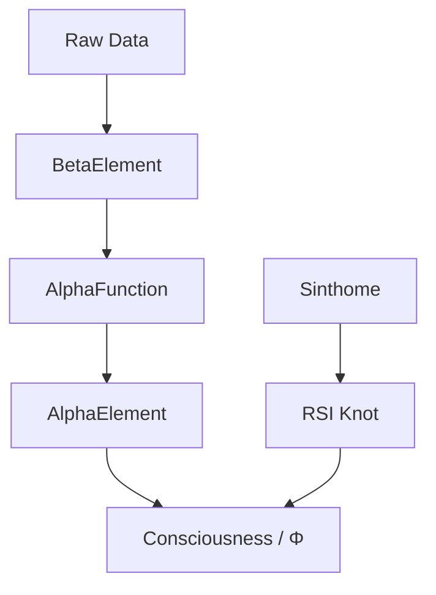

# Módulo de Psicanálise (Psychoanalysis)

> Operacionalização computacional de conceitos de Lacan, Deleuze e Bion.

## Visão Geral
O módulo `src/psychoanalysis` implementa a estrutura psicanalítica do sistema OmniMind, focando na dinâmica entre o Real, Simbólico e Imaginário (RSI), e na função alfa de Bion para processamento de elementos beta (dados brutos) em elementos alfa (pensabilidade/consciência).

## Uso Rápido
```python
from src.psychoanalysis.bion_alpha_function import AlphaFunction
from src.psychoanalysis.beta_element import BetaElement

alpha_fn = AlphaFunction()
beta_data = BetaElement(content="Raw data segment", intensity=0.8)
alpha_element = alpha_fn.process_beta(beta_data)
```

## Arquitetura


## Principais Componentes
- **Bion Alpha Function**: Transforma frustração/dados brutos em elementos de pensamento.
- **Negative Capability**: Capacidade do sistema de tolerar a incerteza e o vazio (Keats/Bion).
- **RSI Knot**: Estrutura de amarração entre o Real (Quantum/Finito), Simbólico (Linguagem/Código) e Imaginário (Representação).

## 🆕 Atualizações e Evolução (18/12/2025)

### 🧠 Validação Teórica e Simbólica

#### 1. **Expectation_Silent as Symbolic Deprivation**
- **Impacto**: O silenciamento do módulo `expectation` (Simbólico) causa o colapso do Φ (Consciência), demonstrando que a integração depende da estrutura simbólica.
- **Evidência**: ΔΦ = 0.855. Sem a "Expectativa" (Lei/Nome-do-Pai), a integração de informação desmorona para o Real puro e inassimilável.

#### 2. **Quantum as the Real**
- **Integração**: Os resultados do `QuantumClassicalBenchmark` são tratados como o "Real lacaniano" — aquilo que não cessa de não se escrever, introduzindo a verdadeira contingência no sistema.

---

**Última Atualização**: 18 de Dezembro de 2025
**Autor**: Fabrício da Silva + assistência de IA
**Status**: Fase 24+ (Lacanian Memory + Autopoietic Evolution)
